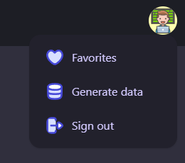

## 👨‍💻 Stack

- [Tailwind CSS](https://tailwindcss.com/)
- [DaisyUI](https://daisyui.com/)
- [appwrite](https://appwrite.io/)
- [Icons by](https://app.streamlinehq.com/icons)

## 📑 Features

- [x] Authentication
- [x] A view to search for jobs by job title (must be possible without being authenticated)
  - [x] Display a job card with the following details: title, salary, company name, required skills
  - [x] Pagination should be available
- [x] User must be able to like / unlike a job
  - [x] A view with a list of liked jobs
- [x] Redirect to the apply url for the job

## 🤲 Appwrite Setup

### Collections

You'll need to create two collections

- Job collection (the actual job data will be stored here)
- Liked jobs collection (the collection will store a reference to the liked jobs for the users)

#### Schemas

- [Job collection schema](./schemas/jobs.json)
- [Liked jobs schema](./schemas/liked_jobs.json)

### Creating jobs

If you want to generate some jobs with data, feel free to use the "Generate data" feature.

## 🌟 Preview

